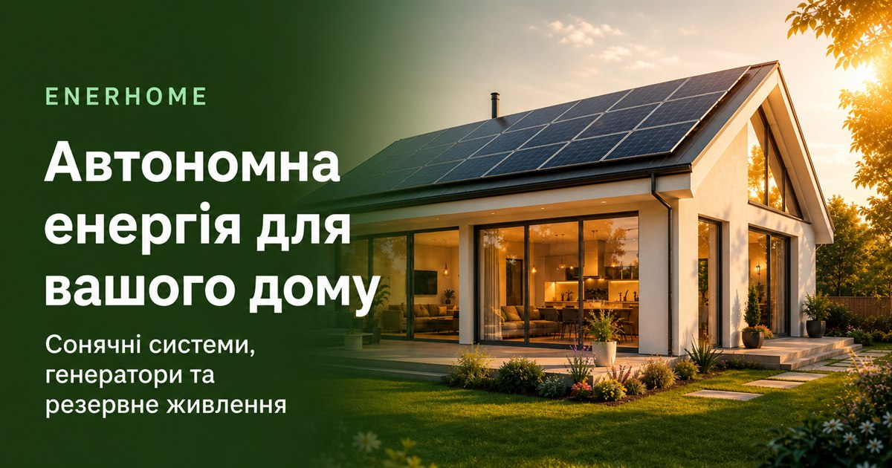

# EnerHome

Автономна енергія для вашого дому.

Лендінг компанії, яка підбирає сонячні системи, генератори та резервне живлення для приватних будинків — від коротких відключень до повної енергонезалежності.

**Живий сайт:** [ener-home.vercel.app](https://ener-home.vercel.app/)



## Про продукт

EnerHome допомагає власникам будинків зрозуміти, яка система їм потрібна, і залишити заявку на консультацію. Сторінка зібрана як односторінковий лендінг з адаптивною версткою під навчальні стандарти **375 / 834 / 1440**.

## Секції

1. **Hero** — головний офер і заявка на консультацію
2. **Підбір системи** — резерв або повна автономність
3. **Квіз** — короткі питання про будинок і потреби
4. **Рішення** — сонце, генератори, станції, акумулятори, інвертори
5. **Як це працює** — шлях від заявки до встановлення
6. **Проєкти** — карусель реалізованих об’єктів
7. **Про нас** — підхід компанії
8. **FAQ** — відповіді на типові питання
9. **Фінальний CTA + футер** — повторний заклик і контакти

## Запуск

```bash
npm install
npm run dev
```

Відкрийте [http://localhost:3000](http://localhost:3000).

```bash
npm run build
npm start
```

## Прев’ю в Discord і Telegram

Посилання відкривається карткою з фото будинку, назвою **EnerHome** і коротким описом.

Канонічний URL продакшену:

```bash
NEXT_PUBLIC_SITE_URL=https://ener-home.vercel.app
```

Зразок змінних: `.env.example`. На Vercel ця змінна підхоплюється автоматично з домену проєкту.

Після деплою перевірте картку:

- Discord — вставте [https://ener-home.vercel.app/](https://ener-home.vercel.app/) у чат
- Telegram — [@WebpageBot](https://t.me/WebpageBot)
- [opengraph.xyz](https://www.opengraph.xyz/url/https://ener-home.vercel.app/)

Якщо Telegram показує стару картку, натисніть **Refresh preview**. Картинка лежить у `public/og.jpg` (1200×630) — саме цей формат коректно читають Discord і Telegram.

## Стек

Next.js 16 · React 19 · TypeScript · CSS Modules · `next/font` (Montserrat, IBM Plex Serif)

## SEO

- Метадані Open Graph і Twitter `summary_large_image`
- `robots.ts`, `sitemap.ts`, web app manifest
- JSON-LD: Organization, WebSite, WebPage, FAQPage
- Українська мова сторінки (`lang="uk"`)

## Структура

```
app/           сторінка, SEO, іконки, sitemap
components/    секції лендінгу
lib/           тексти сайту, FAQ, валідація телефону
public/        фото, спрайт іконок, og.jpg
```

## Ліцензія

Приватний навчальний проєкт. © 2026 EnerHome
